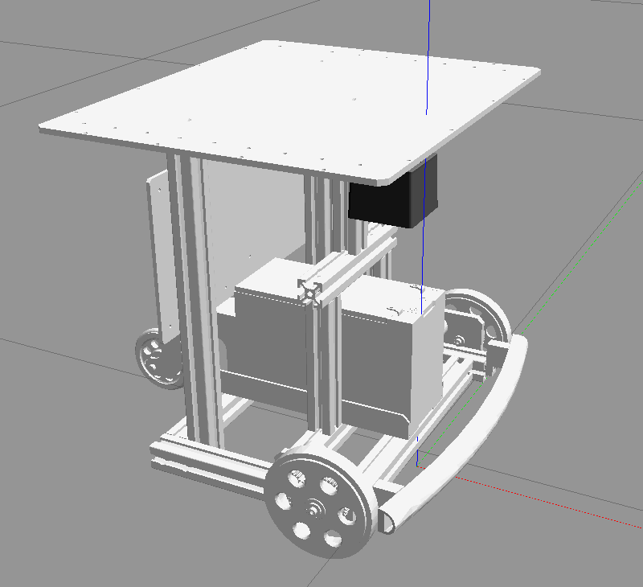
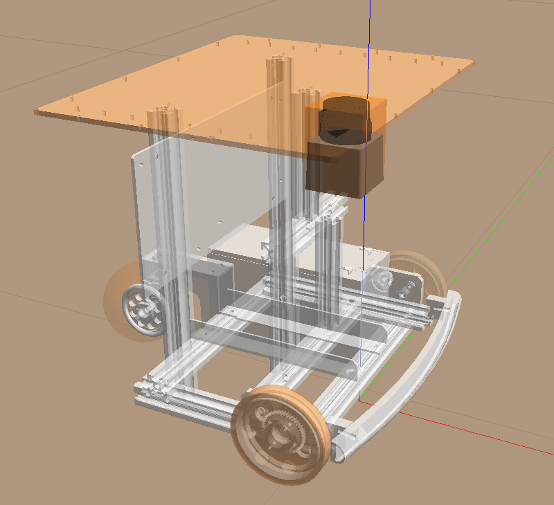
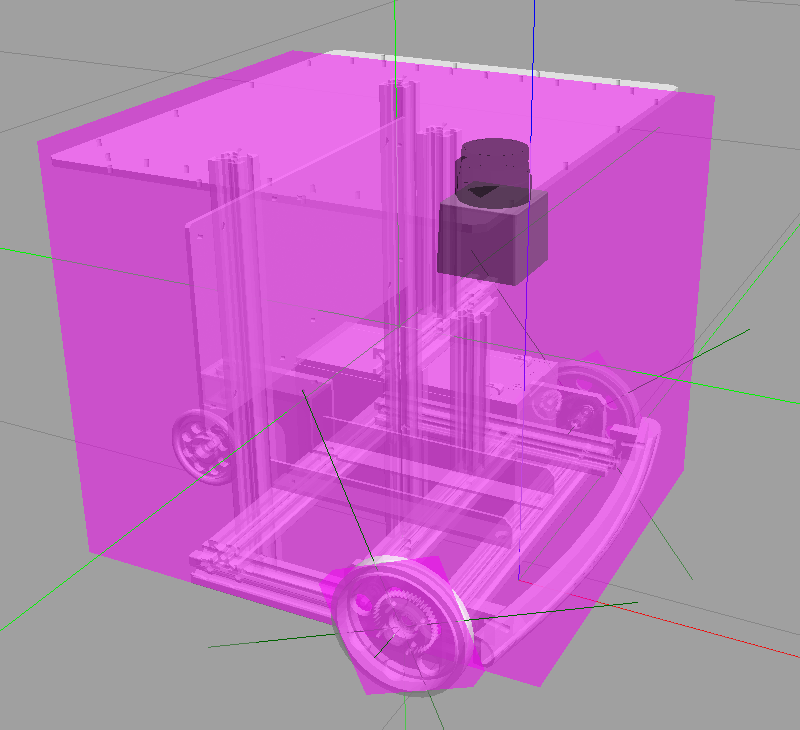

# beego_gazebo
筑波大学知能ロボット研究室の研究プラットフォーム「山彦」（beego）のGazebo用シミュレータです。




# 必要なパッケージ
Ubuntu 16.04 + ROS Kinetic の場合，以下のパッケージが必要です（他にもあればメモしておいて下さい）。
- ros-kinetic-gazebo-ros-control
- ros-kinetic-ros-control
- ros-kinetic-ros-controllers
- gazebo_ros_demos

ワークスペースが"catkin_ws"の場合，以下のコマンドでインストールします。
```
$ sudo apt-get install ros-kinetic-gazebo-ros-control
$ sudo apt-get install ros-kinetic-ros-control
$ sudo apt-get install ros-kinetic-ros-controllers
$ cd ~/catkin_ws/src
$ git clone https://github.com/ros-simulation/gazebo_ros_demos.git
```
**※パッケージ名は自分の使っているROSのdistributionに合わせて下さい。**

例えば，ROS Melodicの場合"**kinetic**"を"**melodic**"に置き替えます。


# インストール方法
```
$ cd ~/catkin_ws/src
$ git clone https://github.com/dlab-ut/beego_gazebo.git
```


# 実行方法
まずはGazeboで空のworldを立ち上げます。
```
（端末1）$ roslaunch gazebo_ros empty_world.launch
```

ロボットを出現させます。
```
（端末2）$ roslaunch beego_gazebo beego.launch
```

シミュレーションをやり直す場合は，全ての端末をCtrl-cで終了させてから立ち上げ直して下さい。


# トピックについて
基本的な使い方としては，

- オドメトリ: `/beego/diff_drive_controller/odom`
- URG: `/beego/scan`

をSubscribeして，
- 速度: `/beego/diff_drive_controller/cmd_vel`

をPublishすることでロボットを動かします。

以下，それぞれ簡単に説明します。

- 速度司令の発行

ロボットを動かすには`/beego/diff_drive_controller/cmd_vel`トピックをPublishします。

例えば，以下のパッケージを使うとキーボードで動かすことができます。
```
（端末3）$ sudo apt-get install ros-kinetic-teleop-twist-keyboard
（端末3）$ rosrun teleop_twist_keyboard teleop_twist_keyboard.py cmd_vel:=/beego/diff_drive_controller/cmd_vel
```
この端末上で，"i"や","を入力すると速度コマンドがPublishされます（操作方法が表示されるのでそちらを参照）。

- オドメトリ

Rvizで表示される`beego/odom - beego/base_footprint`間が測定されているオドメトリです。

以下のコマンドで生データを表示することが出来ます。
```
（端末4）$ rostopic echo /beego/diff_drive_controller/odom
```

- URG

URGの測定範囲は0.1[m]から5.6[m]，-120[deg]から+120[deg]に設定しています。

GazeboのGUIで立方体などを測定範囲内に置くと，Rvizで点群が確認できます。

以下のコマンドで生データを表示することができます。
```
（端末5）$ rostopic echo /beego/scan
```

なお，`--noarr`オプションを付けることでセンサデータの配列の情報を除外することができます。


# コマンドのオプション
beego.launchの引数の説明です。

- ロボットの初期位置を指定する（デフォルトでは`x:=0.0`，`y:=0.0`，`z:=0.0`）
```
$ roslaunch beego_gazebo beego.launch x:=3.0 y:=-2.0
```
この値はGazeboの座標系における位置（単位は[m]）です。

この位置が`/beego/diff_drive_controller/odom`の原点となります。

- ロボットの初期姿勢を指定する（デフォルトでは`R:=0.0`，`P:=0.0`，`Y:=0.0`）
```
$ roslaunch beego_gazebo beego.launch Y:=3.14
```
設定値は，右ねじの方向を正としたRoll-Pitch-Yaw角（単位は[rad]）です。

- ロボット名を指定する（デフォルトでは`ns:=beego`）
```
$ roslaunch beego_gazebo beego.launch ns:=beego1
```
上の場合，トピック名は`/beego1/diff_drive_controller/odom`のようになります。

これにより2台以上を同時に出現させることができます。

- Rvizを起動しない（デフォルトでは`rviz:=true`）
```
$ roslaunch beego_gazebo beego.launch rviz:=false
```


# その他
衝突判定と慣性は以下のように簡略化しています（衝突判定:オレンジ，慣性:紫）。





特に衝突判定は，URGのレーザがロボットの内側を通過するため，車輪，センサ，天板のみとしています。そのため，現状はカルガモのようなシミュレーションは出来ません。
